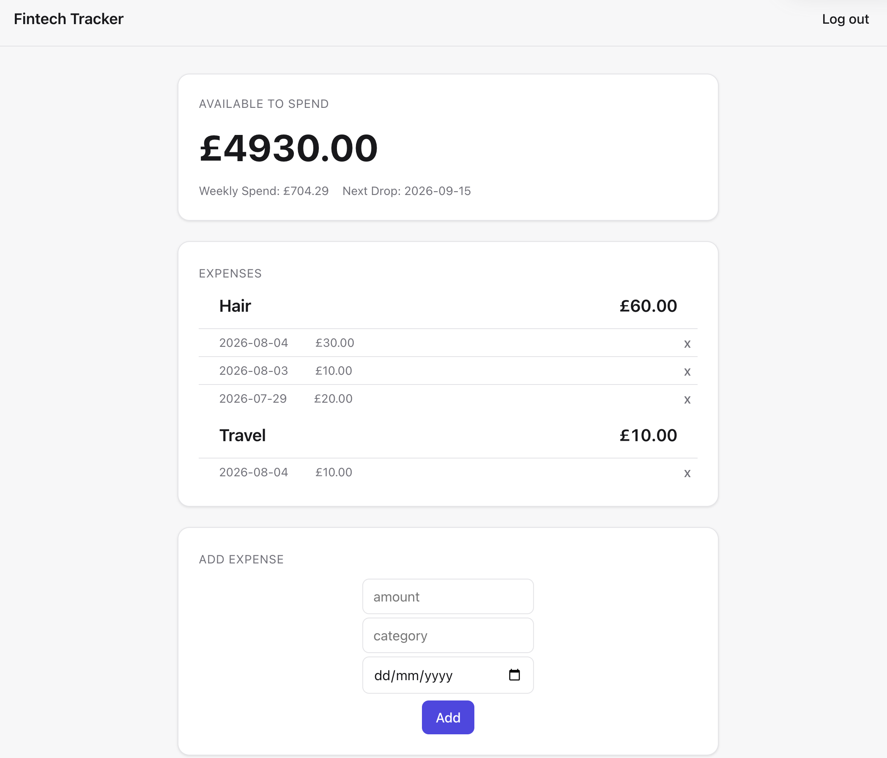

# Fintech Tracker
A personal finance tracker - log expenses, track a loan's installments, and see a weekly 'safe to spend' figure.

**DEMO -->** https://fintech-tracker-y79g.onrender.com

## Tech Stack
- React 19 + Vite (client)
- Express 5 (server)
- PostgreSQL (db)
- Orchestrated with Docker Compose.

## Architecture
The React client only ever calls relative `/api/...` paths, so the same frontend code works in dev and prod. A proxy forwards those calls to the express server, which talks to Postgres via the `pg` connection pool:

React (fetch `/api/...`) -> proxy -> Express -> PostgreSQL

## Dev vs Prod
- Dev: `docker compose up` -> localhost:5173
- Prod: `docker compose -f docker-compose.yml up --build` -> localhost:8080
- Dev is used to see changes happen in real time when developing the project. Prod is used to upload the code for production to be used by real users.

## API reference 
**[API DOCS](./server/API.md)**

